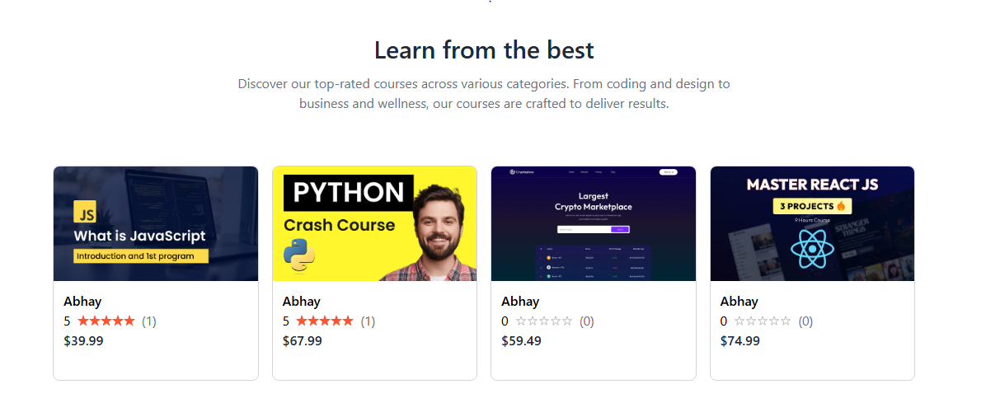

🎓 Edemy – Learning Management System

A modern LMS (Learning Management System) built using React, Tailwind CSS, and Node.js.
Edemy provides a smooth platform to buy, access, and watch courses, featuring secure authentication, a responsive UI, and all the essential tools of a modern online learning system.

## 🔗 Live Demo

👉 [Click Here to Try Edemy](https://edemy-theta.vercel.app/)

# 🚀 Edemy

[](https://reactjs.org/)  
[](https://tailwindcss.com/)

## 📸 Preview





✨ Features

🔐 Secure Authentication (Login / Signup / JWT Auth)

📚 Course Purchase & Access System

🎥 Watch Courses with Video Player

🧑‍🏫 Instructor Dashboard (optional if added)

⚡ Fast and Responsive UI

🎨 Modern Tailwind-based Design

📱 Fully Responsive on All Devices

<br />
<br />

🛠️ Installation & Setup

Clone the repository:

```bash
git clone https://github.com/your-username/edemy.git
cd edemy
```

```bash
npm install
```

Start the development server:

```bash
npm start
```

Open [http://localhost:3000](http://localhost:3000) to view it in the browser.

🧑‍💻 Author

Abhay Chauhan
🔗 [GitHub](https://github.com/abhay-004)
• [LinkedIn](https://www.linkedin.com/in/abhay-chauhan-456869266/)
